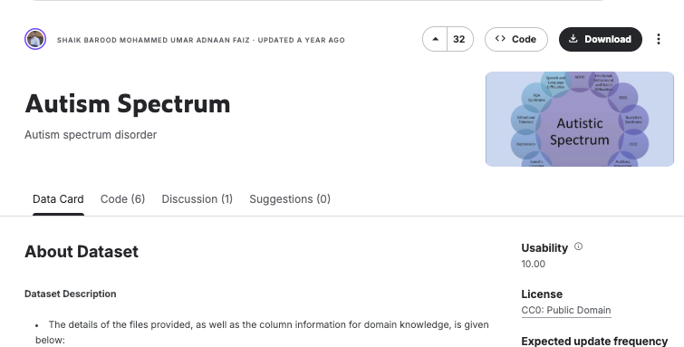
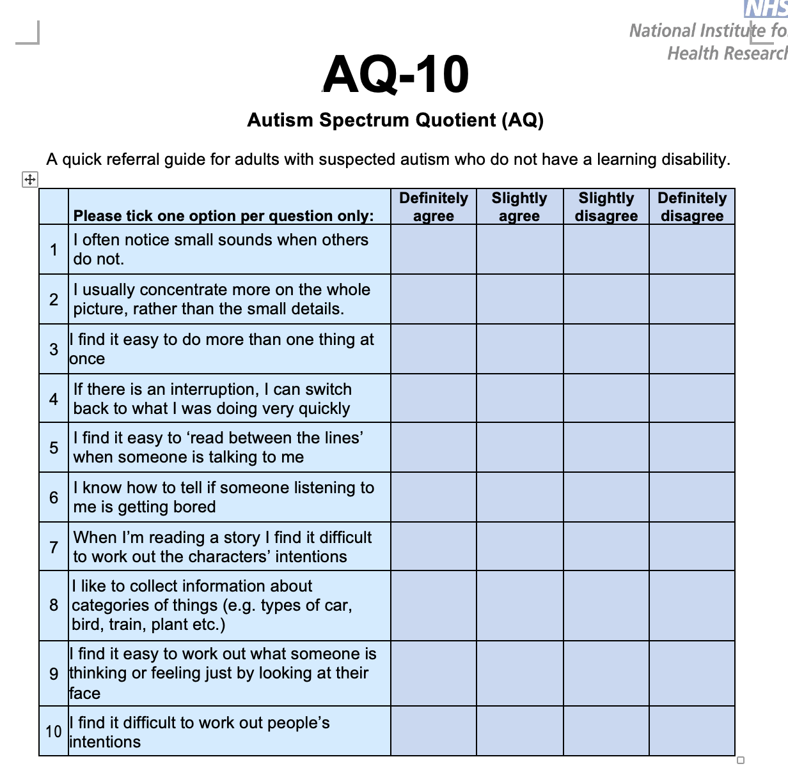
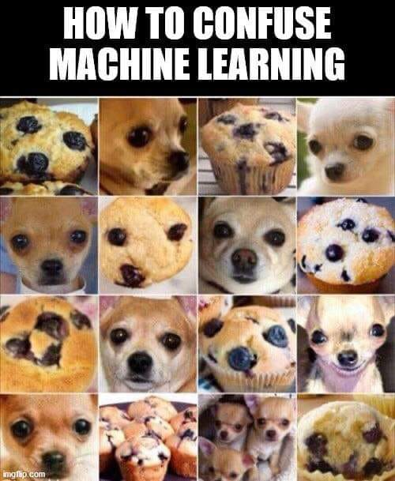

```{r}
### Resource Links ### 
# published at https://maihata.quarto.pub/edld654-ml-project/ 
# "Beautiful presentations with R and Quarto" https://youtu.be/01KifhHDkFk?si=2axQMI_c0Tu9_Z5P 
# quarto themes  https://quarto.org/docs/presentations/revealjs/themes.html
# theme - serif or simple
# ggplot themes https://ggplot2.tidyverse.org/reference/ggtheme.html 
# R graph gallery with pretty colors https://r-graph-gallery.com/ 
# color themes I like https://www.colorhexa.com/404080 
# Intro to linear regression https://www.youtube.com/watch?v=zPG4NjIkCjc 
```

```{r}

library(dplyr)
library(finalfit)
library(lubridate)
library(reticulate)
library(finalfit)
library(stringr)
library(recipes)
library(ggplot2)
library(tidyverse)
library(gt)
library(caret)
library(AppliedPredictiveModeling)
library(glmnet) 
library(vip)
library(patchwork)
library(kableExtra)
library(knitr)
### library(MASS) --- do NOT ever load this, it messed with so much codes
```

## Research problem

```{=html}
<style>
.reveal .slides { font-size:80%; }
</style>
```

**The big question**: How can I design and apply Machine Learning (ML) models without reinforcing existing biases?

{fig-align="center"}

## Research question

-   **Goal**: Predict Autism Spectrum Quotient (AQ-10) screener scores from demographic information.

-   **Potential benefit**: Understanding factors relating to scores can potentially support more focused outreach.

-   **Ethical & equity considerations**: As an Autistic researcher and Early Intervention (EI) specialist, I want to understand how predictive models are created, what their limitations are, and the ethical considerations.

## Data

From [Kaggle](https://www.kaggle.com/datasets/umeradnaan/autism-screening)

-   **Numerical** (age, screener result)
-   **Categorical** (gender f/m, jaundice yes/no, family history of Autism yes/no, used app before yes/no, results from screener results YES (7+) NO (\~6), ethnicity, country of residence)

::: center
{fig-align="center" width="60%"}
:::

## AQ-10 screener

Allison et al. (2012) evaluated shortened 10-item versions of the Autism Spectrum Quotient (AQ-10) as quick “red flag” screening tools for Autism. Using data from over 1,000 Autistic individuals and 3,000 controls, the short forms showed high sensitivity (accurately identifying most people with Autism) and high specificity (correctly excluding those without) across age groups.

{fig-alt="AQ-10 screener image" fig-align="center" width="70%"}

```{r}
#| include: false
setwd("~/Desktop/EDLD654_ML")
```

```{r}
### Following the steps on Kaggle Assignment 1 ###
# Task 1.1. Read data 
#| include: false

autism <- read.csv('/Users/maiko/Desktop/EDLD654_ML/data/Autism_Screening.csv', header=TRUE)
```

```{r}
#| include: false
str(autism)
```

```{r}
#| include: false
autism$gender_binary <- ifelse(autism$gender == "m", 1, 0)
autism$jundice_binary <- ifelse(autism$jundice == "yes", 1, 0)
autism$Class.ASD_binary <- ifelse(autism$Class.ASD == "YES", 1, 0)
```

```{r}
#| include: false
head(autism[c("gender", "gender_binary")])
```

```{r}
#| include: false
table(autism$gender_binary)
```

```{r}
#| include: false
table(autism$gender_binary)
```

## Cleaning up missing data

-   using `ff_glimpse(autism)`

```{r}
#| echo: true 
#| fig-align: center
#| # #| output-location: makes the plot go next page, or column etc. 

ff_glimpse(autism[, 1:20])
```

```{r}
#| echo: false 
autism <- autism[, colMeans(is.na(autism)) <= 0.75]
```

## Cleaning up missing data

-   Since the dataset used “?” for missing values, I calculated how often “?” appeared across columns to check for missing data patterns.

```{r}
#| echo: true 
#| fig-align: center
sum(autism$ethnicity == "?", na.rm = TRUE)
nrow(autism)
mean(autism$ethnicity == "?", na.rm = TRUE) * 100
```

```{r}
#| include: false
autism <- autism %>%
  mutate(
    contry_of_res = str_trim(contry_of_res),
    # remove leading/trailing single or double quotes
    contry_of_res = str_replace_all(contry_of_res, "^[\"']+|[\"']+$", ""),
    # collapse internal extra spaces
    contry_of_res = str_squish(contry_of_res),
    # optional: normalize common variants
    contry_of_res = recode(contry_of_res,
      "USA" = "United States", "U.S." = "United States",
      "United States of America" = "United States"
    )
  )
```

```{r}
# Fixing the "ethnicity" column the same way as above to remove ' " etc.
#| include: false
autism <- autism %>%
  mutate(
    ethnicity = str_trim(ethnicity),
    ethnicity = str_replace_all(ethnicity, "^[\"']+|[\"']+$", ""),
    ethnicity = str_squish(ethnicity)
    )
```

```{r}
#| include: false
autism %>% count(contry_of_res, sort = TRUE)
```

```{r}
#| echo: false
autism$age <- as.numeric(autism$age)
```

```{r}
#| include: false
sum(is.na(autism$age))
```

```{r}
#| include: false
is.numeric(autism$result)
```

```{r}
#| include: false
summary(autism$age)
```

## Descriptive statistics

Autism Screener user results

```{r}
#| echo: true 
#| fig-align: center

ggplot(autism, aes(x = Class.ASD, fill = Class.ASD)) +
  geom_bar() +
  scale_fill_manual(values = c("NO" = "#69b3a2", "YES" = "#404080")) +
  labs(title = "Autism Prevalence by Screener Result",
       x = NULL, y = NULL) +
  theme_minimal(base_size = 14) +
  theme(legend.position = "none",
        plot.title = element_text(hjust = 0.5))
```

## Autism Screener user age

-   Someone was 383 years old 👵🏼

```{r}
#| include: false
# Make age numeric (safe even if already numeric)
if (!is.numeric(autism$age)) {
  autism$age <- readr::parse_number(as.character(autism$age))
}

```

```{r}
#| echo: true 
#| fig-align: center

ggplot(autism, aes(x = age)) +
  geom_histogram(binwidth = 0.5) +
  scale_x_continuous(limits = c(0, max(autism$age, na.rm = TRUE) + 10)) +
  labs(title = "Age Distribution",
       x = "Age",
       y = "Count") +
  theme_minimal()

```

## Descriptive statistics

-   Autism Screener user age with `filter(age <= 100)`

```{r}
#| echo: true 
#| fig-align: center
autism <- autism %>% filter(age <= 100)

ggplot(autism, aes(x = age)) +
  geom_histogram(binwidth = 0.5, fill = "steelblue") +
  labs(title = "Age Distribution",
       x = "Age",
       y = "Count") +
  theme_minimal() +
  theme(plot.title = element_text(hjust = 0.5))
```

```{r}
#| include: false
summary(autism$age)
```

```{r}
#| include: false
autism <- autism %>% 
  filter(age <= 100)
```

```{r}
#| include: false
ggplot(autism, aes(x = age)) +
  geom_histogram(binwidth = 0.5) +
  labs(title = "Age Distribution",
       x = "Age",
       y = "Count") +
  theme_minimal()
```

```{r}
#| include: false
ggplot(autism, aes(x = result)) +
  geom_histogram(binwidth = 0.5, fill = "steelblue") +
  labs(title = "Screener Results",
       x = "Score",
       y = "Count") +
  theme_minimal() +
  theme(plot.title = element_text(hjust = 0.5)) 
```

```{r}
# Categorical variables
#| include: false
cat_vars <- c(
  "gender", 
  "ethnicity", 
  "jundice",       # use your dataset’s spelling
  "austim",        # same spelling as in your data
  "contry_of_res", # same spelling as in your data
  "Class.ASD"
)

# Numeric variables
num_vars <- c(
  "age",
  "result"
)

# Binary-coded versions 
binary_vars <- c(
  "gender_binary",
  "jundice_binary",
  "Class.ASD_binary"
)
```

```{r}
#| include: false
list(
  categorical = cat_vars,
  numerical = num_vars,
  binary = binary_vars
)
```

```{r}
#| include: false
invisible(lapply(cat_vars, function(v) {
  cat("\n---", v, "---\n")
  print(table(autism[[v]], useNA = "ifany"))
}))

```

```{r}
#| include: false
summary(autism[num_vars])
```

## Descriptive statistics

-   Autism Screener user race/ethnicity

```{r}
#| echo: true
#| fig-align: center

ggplot(autism, aes(x = ethnicity)) +
  geom_bar(fill = "steelblue") +
  geom_text(aes(label = after_stat(count)),
            stat = "count",
            vjust = -0.5, size = 3.5) +
  labs(title = "Race/Ethnicity",
       x = "Race/Ethnicity",
       y = "Count") +
  theme_minimal() +
  theme(plot.title = element_text(hjust = 0.5),
        axis.text.x = element_text(angle = 45, hjust = 1))
```

```{r}
### RECIPES ### 
#| include: false
autism_mod <- autism |>
  transmute(
    # outcome
    result,
    # numeric predictors
    age,
    # keep these categoricals to one-hot later
    ethnicity, contry_of_res, austim,
    # keep your existing 0/1 binaries as numeric predictors
    gender_binary, jundice_binary, Class.ASD_binary
  )
```

```{r}
#| include: false
num_poly_ok <- "age"
```

```{r}
#| include: false
rec <- recipe(result ~ ., data = autism)
```

```{r}
#| include: false
rec <- recipe(result ~ ., data = autism)
```

```{r}
#| include: false
rec <- rec |>
  step_indicate_na(all_predictors()) |>        # (1)
  step_zv(all_predictors()) |>                 # (2) catch single-level nominals like age_desc
  step_impute_mean(all_numeric_predictors()) |># (3)
  step_impute_mode(all_nominal_predictors())   # (4)
```

```{r}
#| include: false
rec <- rec |>
  step_poly(age, degree = 3, options = list(raw = TRUE)) |>  # (5)
  step_normalize(all_numeric_predictors()) |>                # (6)
  step_dummy(all_nominal_predictors(), one_hot = TRUE)       # (7)
```

```{r}
#| include: false
rec_prep <- prep(rec, training = autism, verbose = TRUE)
```

```{r}
#| include: false
rec_prep
tidy(rec_prep)
```

```{r}
#| include: false
rec_prep
tidy(rec_prep)
```

```{r}
## recipes package ## 
#| include: false
autism_xf <- bake(rec_prep, new_data = NULL)
```

```{r}
#| include: false
autism_final <- autism_xf |>
  dplyr::rename(score = result) |>
  dplyr::relocate(score)
```

```{r}
#| include: false
view(autism_final)
```

```{r}
#| include: false
#| echo: true 
#| fig-align: center
### 701 rows, 112 variables(features) ### 
dim(autism_final)
names(autism_final)[1:20]
```

```{r}
### TRYING TO DROP Class.ASD because it messes up the data later 11.2.25
# Drop ASD-related columns before modeling
#| include: false
autism_final <- autism_final[ , !startsWith(names(autism_final), "Class.ASD")]
```

```{r}
#| include: false
nrow(autism)
```

```{r}
#| include: false
dup_rows <- autism_final |> 
  mutate(row_id = row_number()) |> 
  filter(duplicated(across(-row_id)) | duplicated(across(-row_id), fromLast = TRUE)) |> 
  arrange_all()
dup_rows
```

## Modeling assumptions

Before building the models, it's important to review the Ordinary Least Squares (OLS) assumptions for linear regression (Ch. 4 & 6, Boehmke, & Greenwell, 2019):

1.  **Linearity**: There should be a roughly linear relationship between predictors and outcome variables.

2.  **Sample size**: The number of observations (n) should be larger than that of the predictors (p).

3.  **Multicollinearity**: The independent variables not be highly correlated to each other (p. 269, Vogt & Johnson, 2016).

## Modeling assumptions

-   ... and yet, I initially included all 10 screener questions (A1_Score\~A10_Score) and "Class.ASD" in the model, overlooking that "result" which is the total of A1\~A10 was already my outcome variable, and "Class.ASD" was simply coded “YES” for scores of 6 or higher.

-   All three models used 10-fold cross-validation to reduce overfitting. This approach provided more reliable measure of generalizability.

```{r}
### NOT USING THE REGULARIZATION PROCESS ###
#| include: false
colnames(autism)
```

```{r}
#| include: false

# ✅ Robust 90/10 split (self-contained)
set.seed(20251102)

stopifnot(exists("autism_final"), is.data.frame(autism_final))

n <- nrow(autism_final)
stopifnot(is.finite(n), n >= 2)

idx <- sample.int(n, size = floor(0.9 * n))
autism_tr <- autism_final[idx, , drop = FALSE]
autism_te <- autism_final[-idx, , drop = FALSE]

```

```{r}
#| include: false

# Build modeling frames from the split data:
# - keep score as outcome
# DROP A1~A10 QUESTION ITEMS FROM PREDICTORS 
# - (Class.ASD* were already dropped from autism_final earlier, but
# keeping the line below is harmless if nothing matches)

X_tr <- autism_tr %>%
select(-matches("^A(10|[1-9])_Score$")) %>%
select(-score)

X_te <- autism_te %>%
select(-matches("^A(10|[1-9])_Score$")) %>%
select(-score)

# Fallback if nothing left: keep numeric predictors (besides score)

if (ncol(X_tr) == 0) {
X_tr <- autism_tr %>% select(where(is.numeric), -score)
X_te <- autism_te %>% select(where(is.numeric), -score)
}

# Bind outcome first

autism_tr_m <- bind_cols(score = autism_tr$score, X_tr)
autism_te_m <- bind_cols(score = autism_te$score, X_te)

# Safety

stopifnot(ncol(autism_tr_m) > 1, ncol(autism_te_m) > 1)

# Clean names & character→factor for modeling

colnames(autism_tr_m) <- make.names(colnames(autism_tr_m))
colnames(autism_te_m) <- make.names(colnames(autism_te_m))
autism_tr_m[] <- lapply(autism_tr_m, function(x) if (is.character(x)) as.factor(x) else x)
autism_te_m[] <- lapply(autism_te_m, function(x) if (is.character(x)) as.factor(x) else x)

```

```{r}
#| include: false
# ✅ 10-fold CV OLS (caret), then held-out test
library(caret)
set.seed(20251102)

cv10  <- trainControl(method = "cv", number = 10)

lm_cv <- caret::train(
  score ~ .,
  data      = autism_tr_m,
  method    = "lm",
  trControl = cv10
)

# CV (training) summary
print(lm_cv)

# Held-out test metrics
pred_cv <- predict(lm_cv, newdata = autism_te_m)
R2_cv   <- cor(pred_cv, autism_te_m$score)^2
MAE_cv  <- mean(abs(pred_cv - autism_te_m$score))
RMSE_cv <- sqrt(mean((pred_cv - autism_te_m$score)^2))

cat("Held-out Test (10-fold CV lm)\n",
    "R²:", round(R2_cv, 3),
    " MAE:", round(MAE_cv, 3),
    " RMSE:", round(RMSE_cv, 3), "\n")

```

```{r}
#| include: false

#| label: fit-caret-cv
#| dependson: build-ml-frames
#| include: false
library(caret)
set.seed(20251102)
cv10 <- trainControl(method = "cv", number = 10)

glm_cv <- caret::train(
score ~ ., data = autism_tr_m,
method = "glm", family = gaussian(), trControl = cv10
)

pred_cv <- predict(glm_cv, newdata = autism_te_m)
R2_cv   <- cor(pred_cv, autism_te_m$score)^2
MAE_cv  <- mean(abs(pred_cv - autism_te_m$score))
RMSE_cv <- sqrt(mean((pred_cv - autism_te_m$score)^2))

```

```{r}
#| label: coef-counts
#| dependson: lm-cv10
#| echo: true
length(coef(lm_cv$finalModel))

```

```{r}
#| include: false
# Baseline mean-only predictions
mean_pred <- mean(autism_tr$score)
pred_base <- rep(mean_pred, nrow(autism_te))

# Compute metrics
R2_base   <- cor(pred_base, autism_te$score)^2
MAE_base  <- mean(abs(pred_base - autism_te$score))
RMSE_base <- sqrt(mean((pred_base - autism_te$score)^2))

```

```{r}
#| include: false
summary(pred_cv);  sum(is.na(pred_cv))

# Optional also check the plain lm:
# summary(pred_lm); sum(is.na(pred_lm))

```

```{r}
# Baseline mean-only predictions
#| echo: true

mean_pred <- mean(autism_tr$score)
pred_base <- rep(mean_pred, nrow(autism_te))

# Compute metrics
R2_base   <- cor(pred_base, autism_te$score)^2
MAE_base  <- mean(abs(pred_base - autism_te$score))
RMSE_base <- sqrt(mean((pred_base - autism_te$score)^2))

```

## Model 1: Ridge Regularization model

```{r}
#| include: false

set.seed(20251102)

n <- nrow(autism_final)
loc <- sample(seq_len(n), size = round(0.9 * n))

autism_tr <- autism_final[loc, ]
autism_te <- autism_final[-loc, ]
```

```{r}
# ✅ Chunk 1 – Define the recipe (blueprint)
#| include: false
library(recipes)

blueprint <- recipe(score ~ ., data = autism_tr) %>%
  # Remove leakage & any leftover binary label if present
  step_rm(matches("^A(10|[1-9])_Score$"), any_of("Class.ASD_binary")) %>%
  # Impute missing values (adjust if you prefer other strategies)
  step_impute_median(all_numeric_predictors()) %>%
  step_impute_mode(all_nominal_predictors()) %>%
  # Drop zero / near-zero variance
  step_zv(all_predictors()) %>%
  step_nzv(all_predictors()) %>%
  # (Optional) Collapse rare levels to "other" (e.g., <1% of rows)
  # step_other(all_nominal_predictors(), threshold = 0.01) %>%
  # One-hot encode categoricals BEFORE normalization
  step_dummy(all_nominal_predictors(), one_hot = TRUE) %>%
  # Normalize numeric predictors (now includes dummies if you want them scaled)
  step_normalize(all_numeric_predictors())
  # (Optional for OLS) mitigate multicollinearity:
  # step_lincomb(all_numeric_predictors()) %>%
  # step_corr(all_numeric_predictors(), threshold = 0.99)

```

```{r}
#| include: false

# ✅ Chunk 2 – Create folds and cross-validation control
autism_tr <- autism_tr[sample(nrow(autism_tr)), ]
folds <- cut(seq_len(nrow(autism_tr)), breaks = 10, labels = FALSE)
my.indices <- vector("list", 10)
for (i in 1:10) my.indices[[i]] <- which(folds != i)
cv <- trainControl(method = "cv", index = my.indices)
```

```{r}
#| include: false
#✅ Chunk 3 – Create tuning grid and train ridge model
# Ridge grid (alpha = 0)
grid <- data.frame(alpha = 0, lambda = seq(0.01, 3, 0.01))

ridge <- caret::train(
  blueprint,
  data      = autism_tr,
  method    = "glmnet",
  trControl = cv,
  tuneGrid  = grid
)
```

```{r}
#| echo: true

plot(ridge)
ridge$bestTune

```

```{r}
#| include: false

coefs <- coef(ridge$finalModel, ridge$bestTune$lambda)
head(as.matrix(coefs[order(abs(coefs), decreasing = TRUE)[-1], ]), 10)
```

```{r}
#| include: false

# ✅ Chunk 5 – Check top predictors
library(vip)
vip(ridge, num_features = 10, geom = "point") + theme_bw()
```

## Model 1: Ridge Regularization model

```{r}
#| include: false
#| label: build-ridge-frames
#| dependson: split-9010

# Set this flag:
KEEP_SCREEN_ITEMS <- FALSE   # TRUE = keep A1–A10 & Class.ASD*; FALSE = drop them

library(dplyr)

make_frames <- function(tr, te, keep_screen = FALSE) {
  X_tr <- tr
  X_te <- te

  if (!keep_screen) {
    # drop A1–A10 and any Class.ASD*
    drop_pat <- "^A[0-9]+_Score$"
    X_tr <- X_tr %>% select(-matches(drop_pat), -starts_with("Class.ASD"))
    X_te <- X_te %>% select(-matches(drop_pat), -starts_with("Class.ASD"))
  }

  # split into (score + predictors)
  X_tr <- X_tr %>% select(score, everything())
  X_te <- X_te %>% select(score, everything())

  # ensure score is first, and predictors don’t include score
  autism_tr_r <- bind_cols(score = X_tr$score, X_tr %>% select(-score))
  autism_te_r <- bind_cols(score = X_te$score, X_te %>% select(-score))

  # clean names + coerce chars to factors
  cn_tr <- make.names(colnames(autism_tr_r)); colnames(autism_tr_r) <- cn_tr
  cn_te <- make.names(colnames(autism_te_r)); colnames(autism_te_r) <- cn_te
  autism_tr_r[] <- lapply(autism_tr_r, function(x) if (is.character(x)) as.factor(x) else x)
  autism_te_r[] <- lapply(autism_te_r, function(x) if (is.character(x)) as.factor(x) else x)

  # safety
  stopifnot(ncol(autism_tr_r) > 1, ncol(autism_te_r) > 1)

  list(tr = autism_tr_r, te = autism_te_r)
}

ridge_frames <- make_frames(autism_tr, autism_te, keep_screen = KEEP_SCREEN_ITEMS)
autism_tr_r  <- ridge_frames$tr
autism_te_r  <- ridge_frames$te

# quick sanity print
intersect(colnames(autism_tr_r), paste0("A", 1:10, "_Score"))

```

```{r}
#| include: false
#| label: fit-ridge
#| dependson: build-ridge-frames

set.seed(20251102)

cv10 <- trainControl(method = "cv", number = 10)

ridge_grid <- expand.grid(
  alpha  = 0,                        # Ridge
  lambda = 10 ^ seq(3, -3, length.out = 50)
)

ridge <- caret::train(
  score ~ ., 
  data       = autism_tr_r,          # uses frames per flag
  method     = "glmnet",
  trControl  = cv10,
  tuneGrid   = ridge_grid,
  standardize = FALSE                # set TRUE only if you didn't normalize earlier
)

ridge$bestTune

```

```{r}
#| include: false
#| label: eval-ridge
#| dependson: fit-ridge
pred_ridge <- predict(ridge, newdata = autism_te_r)

R2_ridge   <- cor(pred_ridge, autism_te_r$score, use = "complete.obs")^2
MAE_ridge  <- mean(abs(autism_te_r$score - pred_ridge))
RMSE_ridge <- sqrt(mean((autism_te_r$score - pred_ridge)^2))

cat("Held-out Test (Ridge, 10-fold CV)\n",
    "R²:", round(R2_ridge, 3),
    " MAE:", round(MAE_ridge, 3),
    " RMSE:", round(RMSE_ridge, 3), "\n")

```

```{r}
#| include: false
#| label: ridge-vip
#| dependson: fit-ridge
library(vip)
vip(ridge, num_features = 10, geom = "point") + theme_bw()

```

```{r}
#| include: false
#| label: ridge-coefs
#| dependson: fit-ridge
best_lambda <- ridge$bestTune$lambda
co_mat <- as.matrix(coef(ridge$finalModel, s = best_lambda))
coef_df <- tibble::tibble(
  term = rownames(co_mat),
  beta = as.numeric(co_mat)
) |>
  dplyr::filter(term != "(Intercept)") |>
  dplyr::mutate(abs_beta = abs(beta)) |>
  dplyr::arrange(dplyr::desc(abs_beta)) |>
  dplyr::slice_head(n = 15)

coef_df


```

```{r}
#| include: false
#| label: ridge-plot
#| dependson: fit-ridge

plot(ridge)

```

```{r}
#| label: compare-baseline-ridge
#| dependson: [baseline, eval-ridge]
comp <- dplyr::bind_rows(
  data.frame(Model = "Baseline (mean-only)", R2 = R2_base, MAE = MAE_base, RMSE = RMSE_base),
  data.frame(Model = paste0("Ridge (10-CV, keep_screen=", KEEP_SCREEN_ITEMS, ")"),
             R2 = R2_ridge, MAE = MAE_ridge, RMSE = RMSE_ridge)
)
comp_rounded <- dplyr::mutate(comp, dplyr::across(where(is.numeric), ~ round(.x, 3)))
knitr::kable(comp_rounded, digits = 3, caption = "Held-out test metrics")

```

```{r}
# #| label: eval-ridge
# #| dependson: fit-ridge
# 
# # Evaluate Ridge on held-out test data
# 
# pred_ridge <- predict(ridge, newdata = autism_te_m)
# 
# R2_ridge   <- cor(pred_ridge, autism_te_m$score, use = "complete.obs")^2
# MAE_ridge  <- mean(abs(autism_te_m$score - pred_ridge))
# RMSE_ridge <- sqrt(mean((autism_te_m$score - pred_ridge)^2))
# 
# cat("Held-out Test (Ridge, 10-fold CV)\n",
# "R²:", round(R2_ridge, 3),
# " MAE:", round(MAE_ridge, 3),
# " RMSE:", round(RMSE_ridge, 3), "\n")
# 
```

```{r}
# vip(ridge, num_features = 10, geom = "point") + theme_bw()
```

## Model 2: Lasso Regularization model

```{r}
#| include: false
#| label: fit-lasso
# ✅ Fit LASSO (α = 1) with same recipe & CV

grid <- data.frame(alpha = 1, lambda = seq(0.01, 3, 0.01))

lasso <- caret::train(
  blueprint,
  data      = autism_tr,
  method    = "glmnet",
  trControl = cv,
  tuneGrid  = grid
)
```

```{r}
#| echo: false

plot(lasso)
lasso$bestTune
   
```

## Model 2: Lasso Regularization model

```{r}
#| include: false
#| label: eval-lasso
#| dependson: fit-lasso

pred_lasso <- predict(lasso, newdata = autism_te)

R2_lasso   <- cor(pred_lasso, autism_te$score, use = "complete.obs")^2
MAE_lasso  <- mean(abs(autism_te$score - pred_lasso))
RMSE_lasso <- sqrt(mean((autism_te$score - pred_lasso)^2))

cat("Held-out Test (LASSO, 10-fold CV)\n",
    "R²:", round(R2_lasso, 3),
    " MAE:", round(MAE_lasso, 3),
    " RMSE:", round(RMSE_lasso, 3), "\n")

```

```{r}
#| include: false
#| label: lasso-coefs
#| dependson: fit-lasso

best_lambda_lasso <- lasso$bestTune$lambda
co_mat_lasso <- as.matrix(coef(lasso$finalModel, s = best_lambda_lasso))

coef_df_lasso <- tibble::tibble(
  term = rownames(co_mat_lasso),
  beta = as.numeric(co_mat_lasso)
) |>
  dplyr::filter(term != "(Intercept)") |>
  dplyr::mutate(abs_beta = abs(beta)) |>
  dplyr::arrange(dplyr::desc(abs_beta)) |>
  dplyr::slice_head(n = 15)

coef_df_lasso

```

```{r}
#| label: fit-lasso-2
#| dependson: build-ridge-frames
#| include: false

grid <- data.frame(alpha = 1, lambda = seq(0.01, 3, 0.01))

lasso <- caret::train(
  blueprint,
  data      = autism_tr,   # OR use autism_tr_r if that's what you eval with
  method    = "glmnet",
  trControl = cv,
  tuneGrid  = grid
)
```

```{r}
#| include: false
#| label: eval-lasso-2
#| dependson: fit-lasso
#| 
pred_lasso <- predict(lasso, newdata = autism_te)  

R2_lasso   <- cor(pred_lasso, autism_te_r$score, use = "complete.obs")^2
MAE_lasso  <- mean(abs(autism_te_r$score - pred_lasso))
RMSE_lasso <- sqrt(mean((autism_te_r$score - pred_lasso)^2))

cat("Held-out Test (Lasso, 10-fold CV)\n",
    "R²:", round(R2_lasso, 3),
    " MAE:", round(MAE_lasso, 3),
    " RMSE:", round(RMSE_lasso, 3), "\n")

```

```{r}
#| include: false
#| label: lasso-vip
#| dependson: fit-lasso
library(vip)
vip(lasso, num_features = 10, geom = "point") + theme_bw()

```

```{r}
#| include: false
#| label: lasso-coefs-2
#| dependson: fit-lasso
best_lambda_lasso <- lasso$bestTune$lambda
co_mat_lasso <- as.matrix(coef(lasso$finalModel, s = best_lambda_lasso))

lasso_coef_df <- tibble::tibble(
  term = rownames(co_mat_lasso),
  beta = as.numeric(co_mat_lasso)
) |>
  dplyr::filter(term != "(Intercept)") |>
  dplyr::mutate(abs_beta = abs(beta), kept = beta != 0)

# Top 15 by |β|
ggplot2::ggplot(
  lasso_coef_df |>
    dplyr::arrange(dplyr::desc(abs_beta)) |>
    dplyr::slice_head(n = 15),
  ggplot2::aes(x = reorder(term, abs_beta), y = beta, fill = kept)
) +
  ggplot2::geom_col() +
  ggplot2::coord_flip() +
  ggplot2::labs(title = "Top 15 predictors by |β| (Lasso, no new recipe)",
                x = "Predictor", y = "Coefficient (signed)") +
  ggplot2::theme_minimal() +
  ggplot2::theme(legend.position = "none")

```

```{r}
#| echo: false
#| label: compare-baseline-ridge-lasso
#| dependson: [baseline, eval-lasso]
rows <- list(
  data.frame(Model = "Baseline (mean-only)", R2 = R2_base, MAE = MAE_base, RMSE = RMSE_base)
)

if (exists("R2_ridge")) {
  rows <- c(rows, list(data.frame(
    Model = paste0("Ridge (10-CV, keep_screen=", KEEP_SCREEN_ITEMS, ")"),
    R2 = R2_ridge, MAE = MAE_ridge, RMSE = RMSE_ridge
  )))
}

rows <- c(rows, list(data.frame(
  Model = paste0("Lasso (10-CV, keep_screen=", KEEP_SCREEN_ITEMS, ")"),
  R2 = R2_lasso, MAE = MAE_lasso, RMSE = RMSE_lasso
)))

comp_l1 <- dplyr::bind_rows(rows) |>
  dplyr::mutate(dplyr::across(dplyr::where(is.numeric), ~ round(.x, 3)))

knitr::kable(comp_l1, digits = 3, caption = "Held-out test metrics: Baseline vs Ridge vs Lasso")

```

```{r}
#| include: false

# pred_te_lasso <- predict(lasso, newdata = autism_te)
# 
# rsq_te_lasso  <- cor(autism_te$score, pred_te_lasso, use = "complete.obs")^2
# mae_te_lasso  <- mean(abs(autism_te$score - pred_te_lasso))
# rmse_te_lasso <- sqrt(mean((autism_te$score - pred_te_lasso)^2))
# 
# cat("LASSO test R²:", round(rsq_te_lasso, 3),
#     "\nMAE:", round(mae_te_lasso, 3),
#     "\nRMSE:", round(rmse_te_lasso, 3), "\n")
```

```{r}
# ✅ Inspect age polynomial features in training data
#| include: false

# Find all polynomial columns
# age_poly_vars <- grep("^age_poly_", names(autism_tr), value = TRUE)
# 
# cat("Polynomial age features found:\n")
# print(age_poly_vars)
# 
# # Peek at their distributions
# autism_tr %>%
#   select(all_of(age_poly_vars)) %>%
#   summary()
```

```{r}
#| include: false
# comp <- rbind(
#   data.frame(Model = "Mean Only", R2 = R2_base, MAE = MAE_base, RMSE = RMSE_base),
#   data.frame(Model = "Ridge",     R2 = rsq_te,  MAE = mae_te,  RMSE = rmse_te),
#   data.frame(Model = "Lasso",     R2 = rsq_te_lasso, MAE = mae_te_lasso, RMSE = rmse_te_lasso)
# )
# 
# comp_rounded <- comp %>% mutate(across(where(is.numeric), round, 3))
# comp_rounded
```

```{r}
#| include: false
#| label: build-elastic-frames
#| dependson: split-9010
# Builds autism_tr_r / autism_te_r from your 90/10 split

if (!exists("KEEP_SCREEN_ITEMS")) KEEP_SCREEN_ITEMS <- FALSE  # TRUE only for diagnostics

library(dplyr)

drop_pat <- "^A(10|[1-9])_Score$"

prep_frames <- function(df, keep_screen = FALSE) {
  out <- if (keep_screen) df else df %>%
    select(-matches(drop_pat), -starts_with("Class.ASD"))
  out <- out %>% select(score, everything())
  # make names safe + coerce characters to factors
  colnames(out) <- make.names(colnames(out))
  out[] <- lapply(out, function(x) if (is.character(x)) as.factor(x) else x)
  out
}

# uses your existing 90/10 split data: autism_tr, autism_te
autism_tr_r <- prep_frames(autism_tr, KEEP_SCREEN_ITEMS)
autism_te_r <- prep_frames(autism_te, KEEP_SCREEN_ITEMS)

# safety
stopifnot(ncol(autism_tr_r) > 1, ncol(autism_te_r) > 1)
```

```{r}
#| include: false
#| label: fit-elastic
#| dependson: build-elastic-frames
set.seed(20251102)
cv10 <- trainControl(method = "cv", number = 10)
enet_grid <- expand.grid(alpha = seq(0, 1, by = 0.05),
lambda = 10 ^ seq(3, -4, length.out = 60))

elastic <- caret::train(
score ~ .,
data        = autism_tr_r,
method      = "glmnet",
trControl   = cv10,
tuneGrid    = enet_grid,
standardize = FALSE
)

```

```{r}
#| include: false
#| label: elastic-cvplot
#| fig-align: center
#| dependson: fit-elastic
plot(elastic)

```

```{r}
#| include: false
#| label: eval-elastic
#| dependson: fit-elastic
pred_enet <- predict(elastic, newdata = autism_te_r)

R2_enet   <- cor(pred_enet, autism_te_r$score, use = "complete.obs")^2
MAE_enet  <- mean(abs(autism_te_r$score - pred_enet))
RMSE_enet <- sqrt(mean((autism_te_r$score - pred_enet)^2))

cat("Held-out Test (Elastic Net, 10-fold CV)\n",
"R²:", round(R2_enet, 3),
" MAE:", round(MAE_enet, 3),
" RMSE:", round(RMSE_enet, 3), "\n")
```

```{r}
#| include: false
#| label: elastic-vip
#| dependson: fit-elastic
library(vip)
vip(elastic, num_features = 10, geom = "point") + theme_bw()
```

```{r}
#| include: false
#| label: elastic-coefs
#| dependson: fit-elastic
coefs_en <- as.matrix(coef(elastic$finalModel, s = elastic$bestTune$lambda))
coef_df_en <- tibble::tibble(term = rownames(coefs_en), beta = as.numeric(coefs_en)) |>
dplyr::filter(term != "(Intercept)") |>
dplyr::mutate(abs_beta = abs(beta)) |>
dplyr::arrange(dplyr::desc(abs_beta)) |>
dplyr::slice_head(n = 15)

ggplot2::ggplot(coef_df_en, aes(x = reorder(term, abs_beta), y = beta)) +
ggplot2::geom_col() + ggplot2::coord_flip() +
ggplot2::labs(
title = paste0("Top 15 predictors by |β| (Elastic Net, α=",
round(elastic$bestTune$alpha, 2), ", λ=",
signif(elastic$bestTune$lambda, 3), ")"),
x = "Predictor", y = "Coefficient (signed)"
) + ggplot2::theme_minimal()


```

```{r}
#| include: false
#| label: compare-baseline-ridge-lasso-enet
#| dependson: [baseline, eval-ridge, eval-lasso, eval-elastic]

rows <- list(
data.frame(Model = "Baseline (mean-only)", R2 = R2_base, MAE = MAE_base, RMSE = RMSE_base)
)

if (exists("R2_ridge")) rows <- c(rows, list(data.frame(
Model = paste0("Ridge (10-CV, keep_screen=", KEEP_SCREEN_ITEMS, ")"),
R2 = R2_ridge, MAE = MAE_ridge, RMSE = RMSE_ridge
)))

if (exists("R2_lasso")) rows <- c(rows, list(data.frame(
Model = paste0("Lasso (10-CV, keep_screen=", KEEP_SCREEN_ITEMS, ")"),
R2 = R2_lasso, MAE = MAE_lasso, RMSE = RMSE_lasso
)))

if (exists("R2_enet")) rows <- c(rows, list(data.frame(
Model = paste0("Elastic Net (10-CV, keep_screen=", KEEP_SCREEN_ITEMS, ")"),
R2 = R2_enet, MAE = MAE_enet, RMSE = RMSE_enet
)))

comp_all <- dplyr::bind_rows(rows) |>
dplyr::mutate(dplyr::across(dplyr::where(is.numeric), ~ round(.x, 3))) |>
dplyr::arrange(dplyr::desc(R2))

knitr::kable(
comp_all,
digits = 3,
caption = "Held-out test metrics: Baseline vs Ridge vs Lasso vs Elastic Net (sorted by R²)"
)
```

```{r}
# set.seed(20251102)  # reproducibility
# 
# loc        <- sample(seq_len(nrow(autism_final)), round(nrow(autism_final) * 0.9))
# autism_tr  <- autism_final[loc, ]
# autism_te  <- autism_final[-loc, ]
# 
# dim(autism_tr)
# dim(autism_te)
```

```{r}
# blueprint <- recipe(score ~ ., data = autism_tr) %>%
#   # Safely remove columns only if they exist
#   step_rm(matches("^A(10|[1-9])_Score$"), any_of("Class.ASD_binary")) %>%
#   step_zv(all_numeric()) %>%
#   step_nzv(all_numeric()) %>%
#   step_normalize(all_numeric_predictors())
```

```{r}
# Randomly shuffle the training set
# autism_tr <- autism_tr[sample(nrow(autism_tr)), ]
# # 10 folds of ~equal size
# folds <- cut(seq(1, nrow(autism_tr)), breaks = 10, labels = FALSE)
# 
# # Indices list for caret
# my.indices <- vector("list", 10)
# for (i in 1:10) {
#   my.indices[[i]] <- which(folds != i)
# }
# 
# cv <- trainControl(method = "cv", index = my.indices)
# 
# caret::getModelInfo()$glmnet$parameters
```

```{r}
# grid <- expand.grid(
#   alpha  = seq(0, 1, 0.01),     # ridge → lasso
#   lambda = seq(0.001, 0.5, 0.005)
# )
# grid
```

```{r}
# Sys.time()
# 
# elastic <- caret::train(
#   blueprint,
#   data      = autism_tr,
#   method    = "glmnet",
#   trControl = cv,
#   tuneGrid  = grid
# )
# 
# Sys.time()
```

## Model 3: Elastic Net Regression model 

```{r}
#| echo: true

plot(elastic)
elastic$bestTune        
```

```{r}
# options(scipen = 99)
# 
# coefs <- coef(elastic$finalModel, elastic$bestTune$lambda)
# coefs
# 
# # Count exact zeros
# coefs.zero <- coefs[which(coefs[, 1] == 0), ]
# length(coefs.zero)
# 
# # Rank by absolute magnitude (exclude intercept)
# ind <- order(abs(coefs), decreasing = TRUE)
# head(as.matrix(coefs[ind[-1], ]), 10)
```

```{r}
# #| include: false
# 
# elastic$results %>%
#   ggplot(aes(x = lambda, y = RMSE, color = factor(alpha), group = alpha)) +
#   geom_line(linewidth = 0.8) +
#   scale_x_log10() +
#   labs(title = "Elastic Net Cross-Validation Performance",
#        x = expression(lambda),
#        y = "RMSE (10-fold CV)",
#        color = expression(alpha)) +
#   theme_minimal()
```

```{r}
# #| include: false
# 
# vip(elastic, num_features = 10, geom = "point") +
#   theme_bw()
```

```{r}
# #| include: false
# 
# predict_te_elastic <- predict(elastic, autism_te)
# predict_te_elastic
# 
# rsq_te  <- cor(autism_te$score, predict_te_elastic, use = "complete.obs")^2
# rsq_te
# 
# mae_te  <- mean(abs(autism_te$score - predict_te_elastic))
# mae_te
# 
# rmse_te <- sqrt(mean((autism_te$score - predict_te_elastic)^2))
# rmse_te
```

```{r}
# coefs_en <- as.matrix(coef(elastic$finalModel, s = elastic$bestTune$lambda))
# coef_df_en <- tibble(term = rownames(coefs_en), beta = as.numeric(coefs_en)) %>%
#   filter(term != "(Intercept)") %>%
#   mutate(abs_beta = abs(beta)) %>%
#   arrange(desc(abs_beta)) %>%
#   slice_head(n = 15)
# 
# ggplot(coef_df_en, aes(x = reorder(term, abs_beta), y = beta)) +
#   geom_col() + coord_flip() +
#   labs(
#     title = paste0("Top 15 predictors by |β| (Elastic Net, α=",
#                    round(elastic$bestTune$alpha, 2), ", λ=",
#                    round(elastic$bestTune$lambda, 3), ")"),
#     x = "Predictor", y = "Coefficient (signed)"
#   ) +
#   theme_minimal()
```

```{r}
# # Rename your Elastic Net metrics to the expected names
# rsq_te_enet  <- rsq_te
# mae_te_enet  <- mae_te
# rmse_te_enet <- rmse_te
```

```{r}
#| include: false
#| label: eval-elastic-2
#| dependson: fit-elastic

pred_enet <- predict(elastic, newdata = autism_te_r)

R2_enet   <- cor(pred_enet, autism_te_r$score, use = "complete.obs")^2
MAE_enet  <- mean(abs(autism_te_r$score - pred_enet))
RMSE_enet <- sqrt(mean((autism_te_r$score - pred_enet)^2))

cat("Held-out Test (Elastic Net, 10-fold CV)\n",
    "R²:", round(R2_enet, 3),
    " MAE:", round(MAE_enet, 3),
    " RMSE:", round(RMSE_enet, 3), "\n")

```

```{r}
#| include: false
ls(pattern = "enet")
```

## Evaluating model performance

Among all models, Ridge and Elastic Net regression showed the best performance (R2 = 0.309). LASSO regression performed slightly worse (R2= 0.281), but all three models performed substantially better than the mean-only baseline (R2 = –0.004).

```{r}
#| echo: false
#| label: compare-models
#| dependson: [baseline, eval-ridge, eval-lasso, eval-elastic]

# Recalculate baseline R² properly (mean-only model)
pred_base   <- rep(mean(autism_tr_r$score), nrow(autism_te_r))
R2_base_fix <- 1 - sum((autism_te_r$score - pred_base)^2) /
                    sum((autism_te_r$score - mean(autism_te_r$score))^2)

# Build summary table
comp_all <- dplyr::bind_rows(
  data.frame(Model = "Baseline (mean-only)",
             R2 = R2_base_fix, MAE = MAE_base, RMSE = RMSE_base),
  data.frame(Model = "Ridge (10-fold CV)",
             R2 = R2_ridge, MAE = MAE_ridge, RMSE = RMSE_ridge),
  data.frame(Model = "Lasso (10-fold CV)",
             R2 = R2_lasso, MAE = MAE_lasso, RMSE = RMSE_lasso),
  data.frame(Model = "Elastic Net (10-fold CV)",
             R2 = R2_enet, MAE = MAE_enet, RMSE = RMSE_enet)
) |>
  dplyr::mutate(dplyr::across(where(is.numeric), ~ round(.x, 3))) |>
  dplyr::arrange(dplyr::desc(R2))

knitr::kable(
  comp_all,
  digits = 3,
  caption = "Held-out test metrics: Baseline vs Ridge vs Lasso vs Elastic Net (sorted by R²)"
)

```

```{r}
#| include: false
# --- Ridge coefficients ---
coefs_ridge <- as.matrix(coef(ridge$finalModel, s = ridge$bestTune$lambda))
coef_df_ridge <- tibble(term = rownames(coefs_ridge),
                        beta = as.numeric(coefs_ridge)) %>%
  filter(term != "(Intercept)") %>%
  mutate(model = "Ridge")

# --- LASSO coefficients ---
coefs_lasso <- as.matrix(coef(lasso$finalModel, s = lasso$bestTune$lambda))
coef_df_lasso <- tibble(term = rownames(coefs_lasso),
                        beta = as.numeric(coefs_lasso)) %>%
  filter(term != "(Intercept)") %>%
  mutate(model = "LASSO")

# --- Combine both models ---
coef_both <- bind_rows(coef_df_ridge, coef_df_lasso) %>%
  mutate(abs_beta = abs(beta))

# --- Top 15 features by |β| overall ---
top_terms <- coef_both %>%
  group_by(term) %>%
  summarize(max_abs = max(abs_beta)) %>%
  arrange(desc(max_abs)) %>%
  slice_head(n = 15) %>%
  pull(term)

coef_top <- coef_both %>% filter(term %in% top_terms)

# --- Plot ---
ggplot(coef_top, aes(x = reorder(term, abs_beta), y = beta, fill = model)) +
  geom_col(position = "dodge") +
  coord_flip() +
  labs(
    title = "Ridge vs LASSO: Top 15 Predictor Coefficients",
    x = "Predictor",
    y = "Coefficient (signed)"
  ) +
  theme_minimal() +
  theme(legend.position = "top")
```

```{r}
#| include: false 

### Curious how many were in each countries --- what's the cut off for numbers to be considered predictive (large enough numbers to be a predictor?)

table(autism$ethnicity, useNA = "ifany")
```

```{r}
#| include: false 

table(autism$contry_of_res)
prop.table(table(autism$contry_of_res)) * 100
```

```{r}
# library(dplyr)
# 
# country_counts <- autism %>%
#   count(contry_of_res, name = "n") %>%
#   arrange(desc(n))
# 
# print(country_counts)  # show in Console
# 
# # save as CSV
# write.csv(country_counts, "country_counts.csv", row.names = FALSE)
```

```{r}
# #| include: false 
# 
# cat("Elastic Net R²:", round(rsq_te_enet, 3),
#     "\nMAE:", round(mae_te_enet, 3),
#     "\nRMSE:", round(rmse_te_enet, 3), "\n")

```

```{r}
#| include: false

# Safe defaults: use fixed baseline R² (since mean-only gives NA with cor)
pred_base   <- rep(mean(autism_tr_r$score), nrow(autism_te_r))
R2_base_fix <- 1 - sum((autism_te_r$score - pred_base)^2) /
                    sum((autism_te_r$score - mean(autism_te_r$score))^2)

# Build compact summary table
comp <- tibble::tibble(
  Model = c("Mean Only", "Ridge", "LASSO", "Elastic Net"),
  R2    = c(R2_base_fix,
            ifelse(exists("R2_ridge"), R2_ridge, NA),
            ifelse(exists("R2_lasso"), R2_lasso, NA),
            ifelse(exists("R2_enet"),  R2_enet,  NA)),
  MAE   = c(MAE_base,
            ifelse(exists("MAE_ridge"), MAE_ridge, NA),
            ifelse(exists("MAE_lasso"), MAE_lasso, NA),
            ifelse(exists("MAE_enet"),  MAE_enet,  NA)),
  RMSE  = c(RMSE_base,
            ifelse(exists("RMSE_ridge"), RMSE_ridge, NA),
            ifelse(exists("RMSE_lasso"), RMSE_lasso, NA),
            ifelse(exists("RMSE_enet"),  RMSE_enet,  NA))
)

# Prepare for visualization
comp_long <- comp %>%
  tidyr::pivot_longer(cols = c(R2, MAE, RMSE), names_to = "Metric", values_to = "Value") %>%
  mutate(Model = factor(Model, levels = c("Mean Only", "Ridge", "LASSO", "Elastic Net")))

# Faceted bar plot
ggplot(comp_long, aes(x = Model, y = Value, fill = Model)) +
  geom_col(show.legend = FALSE) +
  facet_wrap(~ Metric, scales = "free_y") +
  labs(title = "Model Comparison: Baseline vs Ridge vs LASSO vs Elastic Net",
       x = NULL, y = NULL) +
  theme_minimal() +
  theme(strip.text = element_text(face = "bold"))

```

```{r}
#| include: false

#| label: eval-elastic
#| dependson: fit-elastic
pred_enet <- predict(elastic, newdata = autism_te_r)

R2_enet   <- cor(pred_enet, autism_te_r$score, use = "complete.obs")^2
MAE_enet  <- mean(abs(autism_te_r$score - pred_enet))
RMSE_enet <- sqrt(mean((autism_te_r$score - pred_enet)^2))

cat("Held-out Test (Elastic Net, 10-fold CV)\n",
    "R²:", round(R2_enet, 3),
    " MAE:", round(MAE_enet, 3),
    " RMSE:", round(RMSE_enet, 3), "\n")


```

```{r}
#| include: false
data.frame(Model = "Elastic Net", R2 = R2_enet, MAE = MAE_enet, RMSE = RMSE_enet)
```

```{r}
#| include: false 
#| label: compare-models-repeat

# Recalculate baseline R² properly (since mean-only model gives NA with cor())
pred_base   <- rep(mean(autism_tr_r$score), nrow(autism_te_r))
R2_base_fix <- 1 - sum((autism_te_r$score - pred_base)^2) /
                    sum((autism_te_r$score - mean(autism_te_r$score))^2)

# Build rows dynamically — only if model metrics exist
rows <- list(
  data.frame(Model = "Baseline (mean-only)",
             R2 = R2_base_fix,
             MAE = MAE_base,
             RMSE = RMSE_base)
)

if (exists("R2_ridge")) {
  rows <- c(rows, list(data.frame(
    Model = "Ridge (10-fold CV)",
    R2 = R2_ridge, MAE = MAE_ridge, RMSE = RMSE_ridge
  )))
}

if (exists("R2_lasso")) {
  rows <- c(rows, list(data.frame(
    Model = "Lasso (10-fold CV)",
    R2 = R2_lasso, MAE = MAE_lasso, RMSE = RMSE_lasso
  )))
}

if (exists("R2_enet")) {
  rows <- c(rows, list(data.frame(
    Model = "Elastic Net (10-fold CV)",
    R2 = R2_enet, MAE = MAE_enet, RMSE = RMSE_enet
  )))
}

comp_all <- dplyr::bind_rows(rows) |>
  dplyr::mutate(dplyr::across(where(is.numeric), ~ round(.x, 3))) |>
  dplyr::arrange(dplyr::desc(R2))

knitr::kable(
  comp_all,
  digits = 3,
  caption = "Held-out test metrics: Baseline vs Ridge vs Lasso vs Elastic Net (sorted by R²)"
)

```

## Model fit - Final model

-   Model efficiency & effectiveness

```{r}
#| echo: true
#| fig-align: center

ggplot(comp_long, aes(x = Metric, y = Value, fill = Model)) +
  geom_col(position = "dodge") +
  labs(title = "Model Performance by Regularization",
       x = "Metric", y = "Value") +
  theme_minimal() +
  theme(plot.title = element_text(hjust = 0.5))

```

## Model fit - Final model

-   Ridge is the winner 🥇

```{r}
#| include: false

coefs <- as.matrix(coef(lasso$finalModel, s = lasso$bestTune$lambda))
coef_df <- tibble(term = rownames(coefs), beta = as.numeric(coefs)) %>%
  filter(term != "(Intercept)") %>%
  mutate(abs_beta = abs(beta)) %>%
  arrange(desc(abs_beta)) %>%
  slice_head(n = 15)

ggplot(coef_df, aes(x = reorder(term, abs_beta), y = beta)) +
  geom_col() +
  coord_flip() +
  labs(title = "Top 15 predictors by |β| (LASSO)",
       x = "Predictor", y = "Coefficient (signed)") +
  theme_minimal()
```

```{r}
#| echo: false
coefs <- as.matrix(coef(ridge$finalModel, s = ridge$bestTune$lambda))
coef_df <- tibble(term = rownames(coefs), beta = as.numeric(coefs)) %>%
  filter(term != "(Intercept)") %>%
  mutate(abs_beta = abs(beta)) %>%
  arrange(desc(abs_beta)) %>%
  slice_head(n = 15)

ggplot(coef_df, aes(x = reorder(term, abs_beta), y = beta)) +
  geom_col() +
  coord_flip() +
  labs(
    title = "Top 15 predictors by |β| (Ridge)",
    x = "Predictor",
    y = "Coefficient (signed)"
  ) +
  theme_minimal()

```

## Model fit - Cut off point

## Model fit - Other considerations

```{r}
# What got dropped? -->

#| echo: false -->

### 11.3.25 ###
# ✅ Which variables did LASSO keep vs drop? (caret + glmnet)
# ✅ List predictors dropped by LASSO (works with caret)

# best_lambda <- lasso$bestTune$lambda

# # Directly use coef() on the glmnet model inside caret
# co <- coef(lasso$finalModel, s = best_lambda)

# # Extract dropped predictors
# dropped <- rownames(as.matrix(co))[as.numeric(co) == 0]
# dropped <- dropped[dropped != "(Intercept)"]

# cat("Dropped predictors (", length(dropped), "):\n", sep = "")
# print(dropped)

# --- You can similarly check kept predictors with: ---
# kept <- rownames(as.matrix(co))[as.numeric(co) != 0]
# kept <- kept[kept != "(Intercept)"]
# print(kept)
```

## What I learned: ML 

-   As with any research method, the quality of data determines the quality of the outcome. In machine learning, this is more critical because it is easy to run models without understanding the dataset or the variables. We must be especially careful about how datasets are constructed, how variables are categorized, and what real-world implications may have.

-   As Gould et al. (2023) noted, “To... effectively eliminate health disparities requires recognition of the subjectivity of data and of the power of data to dictate and reinforce narratives, accompanied by intentional reform of data practices” (p. 12).

## What I learned: Variables & Findings 

-   There were high positive correlations for participants from the U.S., Canada, and Brazil, and lower ones for those from the UAE, India, South Asia, and New Zealand. Reported Autism diagnosis rates are much higher in the U.S. and Canada than in Brazil (World Population Review, 2025), so Brazil’s similarity here was unexpected.

-   This likely reflects who chose to take the online screener rather than true population patterns. Without knowing participants’ motivations, it’s hard to interpret these results.

-   Family history of Autism was a meaningful predictor, but findings like these must never be misread as suggesting that certain racial/ethnic or national groups are “more likely” to be Autistic.

## Conclusion

“... all model building efforts are constrained by the existing data” (Kuhn & Johnson, 2016, p. 61), and also by the assumptions researchers bring to our work.

{fig-align="center" width="75%"}

## References:

::: {style="font-size: 70%;"}
-   Allison, C., Auyeung, B., & Baron-Cohen, S. (2012). Toward brief “Red Flags” for Autism screening: The short Autism Spectrum Quotient and the short Quantitative Checklist in 1,000 cases and 3,000 controls. *Journal of the American Academy of Child & Adolescent Psychiatry*, *51*(2), 202-212.e7.
-   Boehmke, B. & Greenwell, B. (2019). *Hands on Machine Learning with R*. Taylor & Francis.
-   Gould, L. H., Farquhar, S. E., Greer, S., Travers, M., Ramadhar, L., Tantay, L., Gurr, D., Baquero, M., & Vasquez, A. (2023). Data for equity: Creating an antiracist, intersectional approach to data in a local health department. *Journal of Public Health Management and Practice*, *29*(1), 11–20. <https://doi.org/10.1097/PHH.0000000000001579>
-   Growcoot, M. (2023, August 3). *Asian MIT student asks AI for a pro headshot, gets turned White.* PetaPixel. <https://petapixel.com/2023/08/03/asian-mit-student-asks-ai-for-a-pro-headshot-gets-turned-white/>
-   Kuhn, M. and Johnson, K. (2014). *Applied Predictive Modeling in R*. Springer.
-   Siqueira, B. (2025, May 23). *2022 census identifies 2.4 million persons diagnosed with autism spectrum disorder in Brazil.* Agencia Ibge Noticias. <https://agenciadenoticias.ibge.gov.br/en/agencia-news/2184-news-agency/news/43474-2022-census-identifies-2-4-million-persons-diagnosed-with-autism-spectrum-disorder-in-brazil>
-   Vogt, P. W. & Johnson, R. Burke. (2016). *The Sage dictionary of statistics & methodology.* Sage.
-   World Population Review (2025). *Autism rates by country 2025.* <https://worldpopulationreview.com/country-rankings/autism-rates-by-country>
:::

## Thank you!

Please don’t hesitate to reach out via [LinkedIn page](https://www.linkedin.com/in/maikohata/) or [Email](mailto:hata@uoregon.edu), I would love to hear from you! I also invite you to [my website I created using Quarto](https://maihata.github.io/finalproj/) and take a look at [my projects](https://maihata.github.io/finalproj/posts.html).

::: {style="text-align: center;"}
Maiko Hata, University of Oregon
:::

{fig-align="center" width="60%"}
